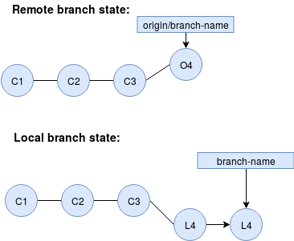

#  Osmitau Git Guidelines

## Commit messages
Commit messages should follow the 50/72 rule, i.e. the message should consist 
of:

1. **First line**: *Issue ID* in all CAPS  followed by the up 
to 50-characters long *title* that neatly 
summarizes the commit
2. **Following lines (optional)**: *Body* of the message, line-wrapped at 72 
characters. In most of the cases, the title should be enough to describe the 
commit. The body should be used only when there are any necessary technical 
details that that cannot be expressed in these strict size constraints.
3. **Last line**: Link to the issue

Above parts (1, 2, 3) should always be separated by the blank lines.

Both body and title should start with capital letter and use the present tense 
i.e. "Fix bug, apply patch", not "Fixed bug, applied patch" nor 
"fix bug, apply patch".

For the reasoning behind the rule and advice on how to configure vim to help 
in following these guidelines please visit: 
https://tbaggery.com/2008/04/19/a-note-about-git-commit-messages.html

### Examples
Usual commit:
```
#123 Change system to use new eyes detection algorithm

https://github.com/universvm/teyered/issues/115
```
Long description necessary:
```
#157 Remove the legacy eyes detection algorithm

Following the transition to the new Capsule Networks based framework for
eye detection as in #115 and #OSMITAU-123 the previously used statistical model
becomes redundant.

Lorem ipsum dolor sit amet, consectetur adipiscing elit. Etiam consequat
leo non tincidunt convallis. Donec eu purus quis ante rhoncus iaculis
eget sed massa. Praesent aliquet a dui in mollis.

https://github.com/universvm/teyered/issues/157
```

Because `#` character is natively treated as a comment character when using vim
for git it causes problems with properly stating issue id. Command
```
git config core.commentChar ";"
```
may be useful to solve that problem.
## What to commit (and push)

Commits in the remote repository should always consist of single **working** 
functionality. I.e.
1. Commit should always apply to only one fix or change. If there are 2 small 
bugfixes that are not correlated, make 2 separate commits for them (even if 
they are just one-liners). Do not attach bugfixes to the commits that 
introduce new functionality. Make one commit for the new functionality and 
separate commits for each of the bugfixes.
2. Never push a commit that contains code that doesn't compile or doesn't pass 
all the tests (if there are any).
3. Usually, new functionality should be contained in a single commit. However, 
if it's too big for single commit it can be split into multiple ones but in 
such a way that at every point in the git history, the code compiles and 
passes all the tests (there should not be a situation where some part of the 
code was committed before the part that it is dependent on was not).

These rules apply to code that is going to the production environment 
(e.g. master branch) only as sometimes a small mess at the feature branches or 
on the local versions is necessary, thus commands
```
git commit --amend
git rebase -i <some-previous-commit>
git push -f
```
becomes useful to make sure we properly clean up commits before creating a pull
request into the production environment (although !NEVER! use `git push -f` on
production branches or on branches that more than 1 person works on).


## Conflicts on push
When fast-forward push/pull request is not possible because the branch we 
worked on changed compared to our local copy



we should always rebase our changes onto the origin branch (not merge) to keep 
the git history clean by
```
git fetch origin branchname
git rebase origin/branchname
git push
```
or
```
git pull --rebase
git push
```
what gives linear, much neater and nicer git history than
```
git pull
git push
```
or equivalent
```
git fetch origin branchname
git merge origin/branchname
git push
```


## Branching
The centre of the whole development should be the master branch. Nothing should
ever be pushed directly to the master. All of the changes should have 
corresponding issue and each issue should have its own branch where changes are
committed and pushed. Once the changes for the issue are finished and are in 
the production-ready state, then the pull request to the master branch should 
be open up to the code review. Of course each pull request should be merged
afterwards as described in `Conflicts on push` section.

Branch names should be fully capitalized and correspond to the full name of
their issue (consisting of repository name followed by hyphen and issue id).
Additionally, all branches but master branch should be assigned to a specific 
type using following naming convention:
```
branch-type/full-issue-name
```
possible branch types:
 - feat/ - new feature
 - bug/ - bugfix
 - test/ - experimental changes
 
feel free to use different types if they are more suitable, however, use them 
consistently with the rest of the company's code.

### Examples
```
feat/TEYERED-5
test/TEYERED-3
feat/OSMITAU-24
bug/EYES-DETECTION-11
```

